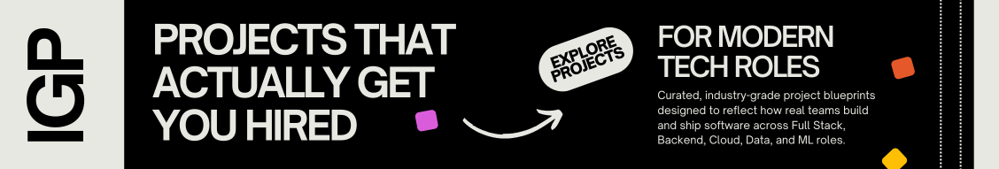
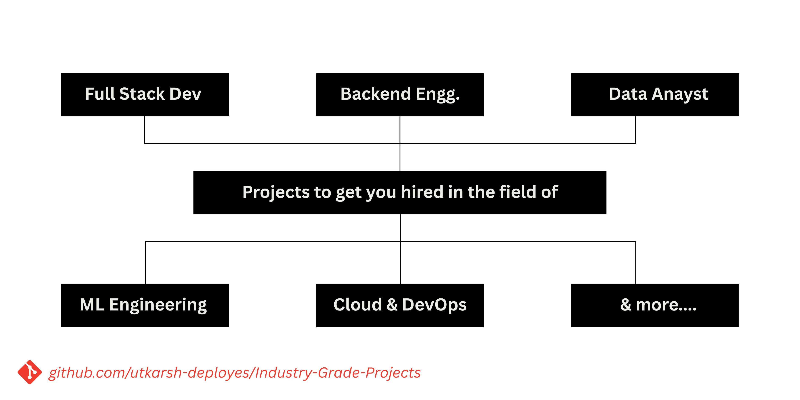

# Industry-Grade-Projects [IGP]



Industry-Grade Projects is a curated collection of hireable, real-world software project blueprints that reflect how products are built in professional engineering teams. These projects are designed to demonstrate practical skills, system thinking, and production-level decision-making across modern technology roles.

If your resume includes these projects, it signals real industry readiness.

---

## Why Most Portfolios Fail

Most student and early-career portfolios are filled with:
- Generic clones such as Netflix, Spotify, or weather apps
- Tutorial-followed projects with no independent thinking
- Shallow CRUD applications with no architectural depth
- Projects that look impressive but explain nothing about real-world work

Recruiters and interviewers see these patterns repeatedly. They rarely differentiate candidates.

---

## What Makes These Projects Different

Every project in this repository is built around how real teams operate.

Each project clearly documents:
- The real-world problem it solves
- Why this problem exists in actual organizations
- How engineering teams approach the solution
- High-level system design and architecture
- Technology choices used in production environments
- A phased implementation roadmap
- Resume-ready bullet points that reflect real impact
- Extension ideas for deeper or senior-level exploration

These projects prioritize depth, clarity, and relevance over volume.

---

## Who This Repository Is For

This repository is intended for:
- Students preparing for internships, placements, or entry-level roles
- Self-taught developers building serious portfolios
- Early-career engineers aiming to stand out in interviews
- Anyone who wants to build projects aligned with real hiring expectations

---

## Available Role-Based Project Guides




Each role below links to a dedicated page containing **industry-grade, hireable project ideas**, complete with architecture, implementation guidance, and resume-ready impact.

- **[Full Stack Developer](./Projects/Full-Stack-Developer.md)**  
  End-to-end, production-ready applications that demonstrate system ownership and real workflows.

- **[Backend Engineer](./Projects/Backend-Engineer.md)**  
  Scalable APIs, data modeling, business logic, and backend system design.

- **[Cloud & DevOps Engineer](./Projects/Cloud-DevOps.md)**  
  Infrastructure, deployment pipelines, monitoring, and production operations.

- **[Data Analyst](./Projects/Data-Analyst.md)**  
  Business-driven analytics projects focused on insights, not dashboards alone.

- **[Machine Learning Engineer](./Projects/ML-Engineer.md)**  
  End-to-end ML systems covering data, models, deployment, and evaluation.

More roles will be added as the repository evolves.

---

## Repository Structure

```
Industry-Grade-Projects/
│
├── README.md
│
├── Projects/
│   ├── Full-Stack-Developer.md
│   ├── Backend-Engineer.md
│   ├── Cloud-DevOps.md
│   ├── Data-Analyst.md
│   └── ML-Engineer.md
│
├── docs/
│   ├── how-to-choose-projects.md
│   ├── project-template.md
│   └── resume-bullets-guide.md
│
├── CONTRIBUTING.md
├── CODE_OF_CONDUCT.md
└── LICENSE
```

---

## Examples of Project Direction

Instead of building:
- A Netflix or Spotify clone

You will build:
- An internal issue tracking system used by engineering teams

Instead of building:
- A basic chat application

You will build:
- A role-based real-time collaboration platform

Instead of building:
- A simple CRUD application

You will build:
- An audit-ready data ingestion and validation pipeline

These examples reflect the type of work companies expect engineers to understand.

---

## How to Use This Repository

1. Identify the role you are targeting
2. Open the corresponding role guide
3. Select one or two projects relevant to your goals
4. Build the project end-to-end with attention to design decisions
5. Use the provided resume bullets as a reference for impact-driven writing
6. Prepare to explain architectural choices and trade-offs during interviews

Quality matters more than quantity.

---

## Contributing

This repository welcomes thoughtful contributions that maintain its quality bar.

You can contribute by:
- Adding new industry-grade project blueprints
- Improving existing role guides
- Sharing real-world insights from professional experience

Please read `CONTRIBUTING.md` before opening a pull request.

---

## Supporting the Repository

If this repository helped you:
- Avoid building low-impact projects
- Understand how real systems are designed
- Strengthen your resume and interview preparation

Consider starring the repository so it reaches more developers.

---

## Final Note

This repository is not about building more projects.

It is about building the right projects.

Projects that reflect how the industry actually works.
